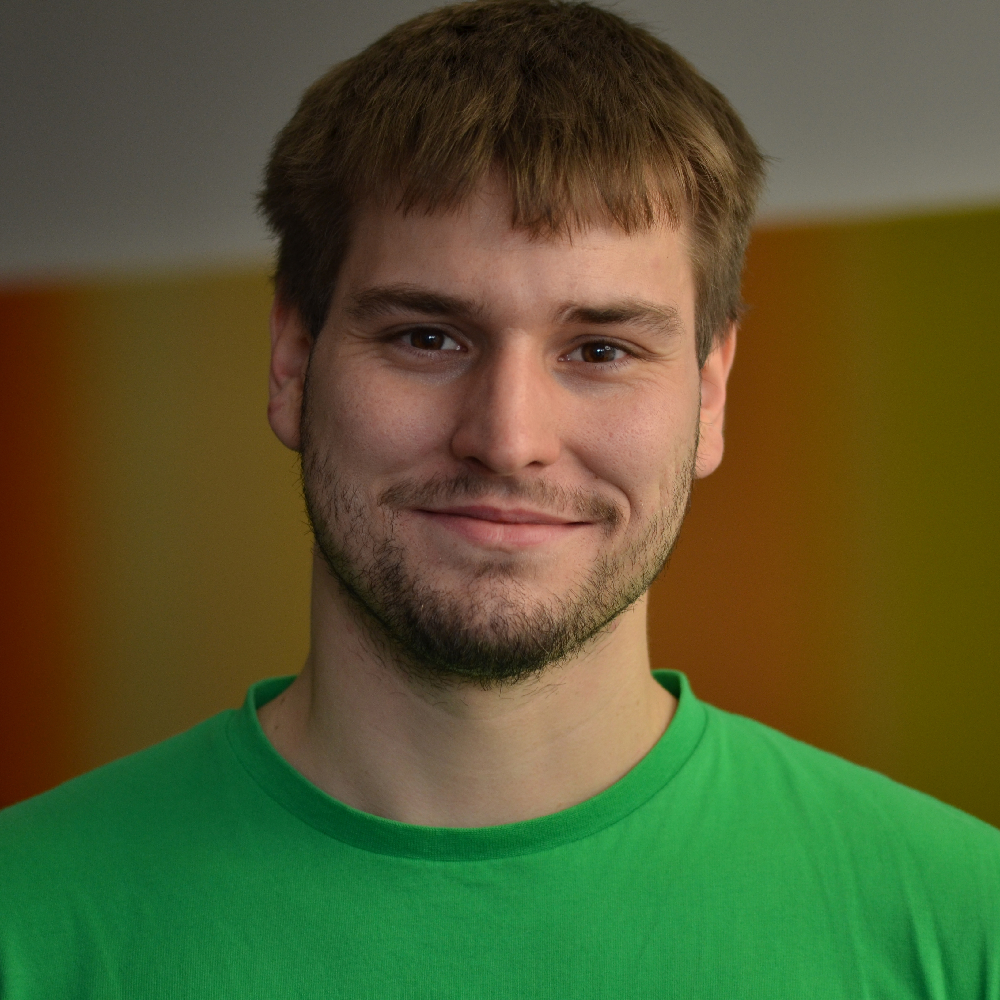

// Load attributes first!
include::attributes-en.adoc[]

= CV Tobias Breitwieser
:doctype: article
:pdf-theme: jernoxit
:pdf-themesdir: themes
:notitle:
:sectnums!:
:icons: font
:source-highlighter: rouge

// Company Branding (selectable via company-branding attribute)
include::sections/company/{company-branding}.adoc[]

// Header with name, title, and photo
[cols="3,1",frame=none,grid=none]
|===
a|
[.name]
*Tobias Breitwieser*

[.title]
Application Development, DevOps, and AI Integration

Updated on {last-updated}

a|

|===

// Contact information
include::sections/en/contact.adoc[]

// Profile
include::sections/en/profile.adoc[]

// Competencies
include::sections/en/skills.adoc[]

// Current projects
include::sections/en/projects-current.adoc[]

// Older projects (optional with ifdef)
ifdef::full-version[]
include::sections/en/projects-archive.adoc[]
endif::[]

ifndef::full-version[]
[NOTE]
====
Additional projects from 2014-2020 available upon request.
====
endif::[]

// Competencies overview
include::sections/en/competencies.adoc[]

// Education
include::sections/en/education.adoc[]

// Work locations
include::sections/en/locations.adoc[]

// Footer
[.footer]
****
_{company}_ +
{company-address} +
{email} • {website}
****
